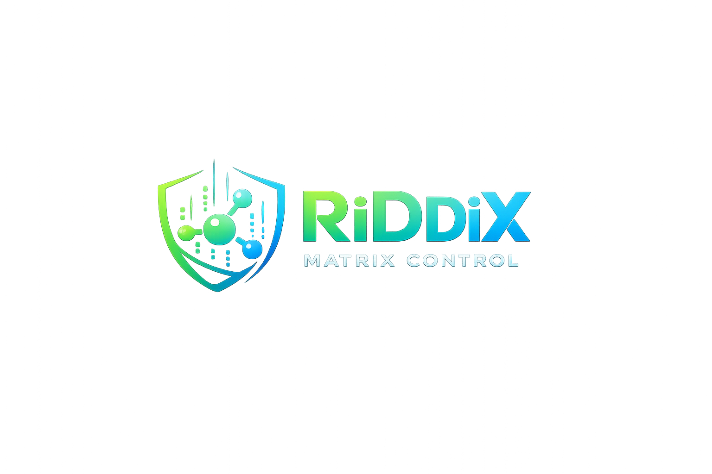

<p align="center">
  
</p>

# RiDDiX - Matrix Synapse Panel

Multi-server administration panel for Matrix Synapse homeservers.

Provides an admin dashboard for managing registration tokens, rooms, integrations, bots, branding, and a public registration page for invited users. Supports managing multiple Synapse homeservers from a single deployment.

**[Documentation](https://riddix.github.io/matrix-synapse-panel/)**

## Features

- **Multi-Server Management** — add, configure, enable/disable, and monitor multiple Synapse homeservers from one dashboard; server context selector for scoped administration; admin token encryption at rest
- **Admin Dashboard** — overview stats, token CRUD with labels/notes, audit log, Synapse diagnostics (all scoped per server)
- **Admin Login** — authenticate with any homeserver via the official Matrix login API (`POST /_matrix/client/v3/login`); verify admin status via Synapse Admin API; store access token encrypted per-server; login flow discovery
- **Room Management** — list rooms (Synapse Admin API), create rooms, view detail/members/messages/threads/state, send messages (including threaded replies), manage membership (invite, kick, ban, unban), alias management, room upgrades — all via official Matrix Client-Server API
- **Server Preparation** — wizard-based config generator for new Synapse deployments; produces `homeserver.yaml`, `docker-compose.yaml`, `.env`, log config, and a post-generation checklist; validates config consistency; downloads individual files or full bundle
- **Integration Management** — install, configure, enable/disable, and monitor bridges and services from a unified catalog of 10 bridges (WhatsApp, Signal, Telegram, Slack, Discord, Google Messages, Meta/Facebook/Instagram, Google Chat, IRC, Twitter/X); supports managed (Docker) and guided (manual) deployment modes; generates appservice registration YAML and Docker Compose fragments
- **Bot Platform** — create bots from templates (welcome, moderation, keyword responder, webhook relay, notification, bridge support, custom command); manage room assignments, feature toggles, and access tokens
- **Media Management** — view per-user media statistics (sorted by size/count), quarantine/unquarantine individual media or all media by room/user, delete individual media, bulk delete old media by date, protect/unprotect media from purges — all via Synapse Admin API
- **Federation Monitoring** — list all federation destinations with status indicators, view retry intervals and failure timestamps, reset failed connections — via `/_synapse/admin/v1/federation/destinations`
- **Event Reports** — list, view details, and delete user-submitted content reports — via `/_synapse/admin/v1/event_reports`
- **Purge History** — permanently delete old messages from rooms by date or event ID, with local event handling option; async purge status tracking — via `/_synapse/admin/v1/purge_history`
- **Background Updates** — monitor running database background updates, enable/disable processing, start specific jobs (e.g. `populate_stats_process_rooms`, `regenerate_directory`) — via `/_synapse/admin/v1/background_updates`
- **Rate Limit Overrides** — get, set, and delete per-user rate limit overrides (messages/second and burst count) — via `/_synapse/admin/v1/users/{userId}/override_ratelimit`
- **Space Management** — create Matrix Spaces (rooms with `m.space` type), add/remove child rooms with suggested flag — via Matrix Client-Server API (`createRoom` + `m.space.child` state events)
- **Token QR Codes** — generate QR codes for invite links, share modal with token/link copy and QR download (uses `qrcode` library)
- **Server Statistics** — per-user media usage statistics with bar visualization, sortable by size/count/user/name, search filter — via `/_synapse/admin/v1/statistics/users/media`
- **Data Export** — export tokens, audit logs, or server configs as JSON or CSV; scoped per server; respects limits
- **Webhook Notifications** — configure HTTP webhook endpoints that fire on admin events (token CRUD, user changes, media actions, federation resets, etc.); HMAC-SHA256 signature verification; per-server or global scope; last-status tracking
- **Admin Permissions (RBAC)** — granular per-user, per-server permission system with 30+ permission types; grant/revoke via UI; global admins retain full access; fine-grained control for delegated administration
- **Branding Management** — full white-label system: visual identity, theme colors, layout presets, custom content, footer links, asset uploads, draft/publish workflow with live preview
- **Public Registration** — branded form with invitation code validation, username/password/display name, dynamic theming from published branding profile
- **Synapse Integration** — wraps Synapse Admin API for token management; uses standard Matrix UIA registration flow with `m.login.registration_token`; Matrix Client-Server API for room operations; per-server connection configuration
- **Security** — admin tokens never exposed to clients, iron-session cookies, rate limiting, input validation (Zod), security headers, audit logging, AES-256-GCM secret encryption, server admin tokens encrypted at rest
- **Dark Mode** — full light/dark theme support
- **Docker Ready** — multi-stage Dockerfile, docker-compose with PostgreSQL, non-root container

## Requirements

- Node.js 20+
- PostgreSQL 14+
- One or more Matrix Synapse homeservers with:
  - `enable_registration: true`
  - `registration_requires_token: true`
  - An admin user access token per server

## Quick Start (Docker)

1. Clone the repository
2. Copy `.env.example` to `.env` and fill in **all** values marked `CHANGE_ME`:
   ```bash
   cp .env.example .env
   # Generate a session secret:
   openssl rand -hex 32
   # Edit .env and replace all CHANGE_ME placeholders
   ```
3. Run:
   ```bash
   docker compose up -d
   ```

The application binds to `127.0.0.1:3000` by default. Use a reverse proxy with TLS termination for production — see the `examples/` directory.

> **Important:** Never expose the application directly to the internet without HTTPS. Always run behind a reverse proxy with a valid TLS certificate.

## Quick Start (Development)

```bash
cp .env.example .env
# Edit .env with your values

npm install
npx prisma migrate dev
npx prisma db seed
npm run dev
```

## Environment Variables

| Variable | Required | Description |
|---|---|---|
| `APP_NAME` | No | Application display name (default: RiDDiX - Matrix Synapse Panel) |
| `APP_URL` | No | Public URL of the application |
| `DATABASE_URL` | Yes | PostgreSQL connection string |
| `SESSION_SECRET` | Yes | Secret for iron-session + AES-256-GCM encryption (min 32 chars) |
| `ADMIN_EMAIL` | Yes | Admin login email |
| `ADMIN_PASSWORD` | Yes | Admin login password (hashed at seed time) |
| `SYNAPSE_INTERNAL_URL` | No* | Legacy single-server: Synapse URL reachable from the app |
| `SYNAPSE_PUBLIC_URL` | No* | Legacy single-server: Public Synapse URL shown to users |
| `SYNAPSE_SERVER_NAME` | No* | Legacy single-server: Matrix server name |
| `SYNAPSE_ADMIN_ACCESS_TOKEN` | No* | Legacy single-server: Synapse admin user access token |
| `RATE_LIMIT_WINDOW_MS` | No | Rate limit window in ms (default: 900000) |
| `RATE_LIMIT_MAX_REQUESTS` | No | Max requests per window (default: 15) |
| `SYNAPSE_CONFIG_DIR` | No | Path to Synapse config dir (for appservice registration in managed mode) |
| `SYNAPSE_APPSERVICE_DIR` | No | Path to Synapse appservice registration dir |

\* These env vars are **optional** when using multi-server management (Admin → Servers). They serve as fallback for backward compatibility with single-server deployments.

## Synapse Configuration

Your `homeserver.yaml` must include:

```yaml
enable_registration: true
registration_requires_token: true
```

Do **not** enable MSC3861/OIDC delegation — this portal uses the standard registration token flow.

### Obtaining an Admin Access Token

1. Log in to your Synapse as an admin user
2. Use the Synapse Admin API or Element's `/devtools` to retrieve the access token
3. For multi-server: add the token when creating a server in Admin → Servers
4. For legacy single-server: set it as `SYNAPSE_ADMIN_ACCESS_TOKEN` in your `.env`

## Architecture

```
src/
├── app/
│   ├── api/
│   │   ├── admin/        # Protected admin endpoints (servers, tokens, stats, audit, diagnostics,
│   │   │                 #   branding, integrations, bots, rooms, matrix-login, server-prep)
│   │   ├── auth/         # Login, logout, session check
│   │   ├── branding/     # Public branding + asset serving
│   │   ├── health/       # Health check endpoint
│   │   ├── server/       # Public server resolution
│   │   └── register/     # Public registration + token validation
│   ├── admin/            # Admin dashboard pages (servers, overview, tokens, integrations, bots,
│   │                     #   branding, audit, diagnostics, rooms, matrix-login, server-prep)
│   └── register/         # Public registration page with dynamic branding
├── __tests__/            # Unit tests (rate limiting, validation, types, branding, integrations,
│                         #   bots, server-prep, endpoints)
├── components/
│   └── ui/               # shadcn/ui components
├── hooks/                # React hooks (toast)
└── lib/                  # Core utilities
    ├── audit.ts          # Audit logging
    ├── auth-guard.ts     # Admin route protection
    ├── branding.ts       # Branding service layer (CRUD, assets, publishing)
    ├── branding-defaults.ts # Default branding values and asset config
    ├── db.ts             # Prisma client
    ├── env.ts            # Environment validation
    ├── integrations/     # Integration management platform
    │   ├── bots.ts       # Bot lifecycle, room assignments, features
    │   ├── catalog/      # Integration catalog + bot templates
    │   ├── crypto.ts     # AES-256-GCM secret encryption
    │   ├── engine.ts     # Integration lifecycle (install, config, health, files)
    │   ├── environment.ts # Deployment mode detection
    │   └── types.ts      # Integration type definitions
    ├── matrix-client.ts  # Matrix Client-Server API service layer (login, rooms, messages, threads)
    ├── rate-limit.ts     # In-memory rate limiting
    ├── session.ts        # iron-session config
    ├── server-prep.ts    # Synapse server preparation config generation engine
    ├── servers.ts        # Multi-server service layer (CRUD, encryption, diagnostics)
    ├── server-context.tsx  # React context for server selection in admin UI
    ├── synapse.ts        # Synapse Admin API wrapper (per-server connections)
    ├── synapse-endpoints.ts # All endpoint constants (Admin API + Client-Server API)
    ├── types.ts          # TypeScript type definitions
    ├── utils.ts          # Utility functions
    └── validation.ts     # Zod schemas
```

## Reverse Proxy

Example configurations are provided in the `examples/` directory:

- **Nginx** — `examples/nginx.conf`
- **Caddy** — `examples/caddy/Caddyfile`
- **Nginx Proxy Manager** — `examples/nginx-proxy-manager.md`
- **SWAG** — `examples/swag.md`

Ensure `X-Forwarded-For` and `X-Real-IP` headers are passed for accurate rate limiting and audit logging.

## API Endpoints

### Public

| Method | Path | Description |
|---|---|---|
| `POST` | `/api/register` | Register a new user (accepts `serverId`) |
| `POST` | `/api/register/validate-token` | Check if a token is valid (accepts `serverId`) |
| `GET` | `/api/server/resolve` | Resolve server by slug, domain, or ID |
| `GET` | `/api/health` | Health check |
| `GET` | `/api/branding` | Active branding config |
| `GET` | `/api/branding/assets/:id` | Serve branding asset |

### Admin (requires authentication)

| Method | Path | Description |
|---|---|---|
| `POST` | `/api/auth/login` | Admin login |
| `POST` | `/api/auth/logout` | Admin logout |
| `GET` | `/api/auth/session` | Check session status |
| `GET` | `/api/admin/servers` | List managed servers |
| `POST` | `/api/admin/servers` | Add a managed server |
| `GET` | `/api/admin/servers/:id` | Get server details |
| `PUT` | `/api/admin/servers/:id` | Update server config |
| `PATCH` | `/api/admin/servers/:id` | Server actions (enable, disable, set_default, rotate_token, diagnostics) |
| `DELETE` | `/api/admin/servers/:id` | Delete a managed server |
| `GET` | `/api/admin/tokens?serverId=` | List tokens (server-scoped) |
| `POST` | `/api/admin/tokens` | Create a token (requires `serverId`) |
| `GET` | `/api/admin/tokens/:token` | Get token details (requires `serverId`) |
| `PUT` | `/api/admin/tokens/:token` | Update a token |
| `DELETE` | `/api/admin/tokens/:token` | Delete a token (requires `serverId`) |
| `GET` | `/api/admin/stats?serverId=` | Dashboard statistics (server-scoped) |
| `GET` | `/api/admin/audit?serverId=` | Audit log entries (optional server filter) |
| `GET` | `/api/admin/diagnostics?serverId=` | Synapse connectivity check (server-scoped) |
| `GET` | `/api/admin/branding` | List branding profiles |
| `POST` | `/api/admin/branding` | Create branding profile |
| `GET` | `/api/admin/branding/:id` | Get branding profile |
| `PUT` | `/api/admin/branding/:id` | Update branding profile (draft) |
| `DELETE` | `/api/admin/branding/:id` | Delete branding profile |
| `PATCH` | `/api/admin/branding/:id` | Reset profile to defaults |
| `POST` | `/api/admin/branding/:id/publish` | Publish branding profile |
| `POST` | `/api/admin/branding/assets` | Upload branding asset |
| `DELETE` | `/api/admin/branding/assets/:id` | Delete branding asset |
| `GET` | `/api/admin/integrations` | List installed integrations |
| `GET` | `/api/admin/integrations?view=catalog` | Browse integration catalog |
| `POST` | `/api/admin/integrations` | Install integration from catalog |
| `GET` | `/api/admin/integrations/:id` | Get integration details + generated files |
| `PUT` | `/api/admin/integrations/:id` | Update integration configuration |
| `PATCH` | `/api/admin/integrations/:id` | Lifecycle actions (enable, disable, health) |
| `DELETE` | `/api/admin/integrations/:id` | Uninstall integration |
| `POST` | `/api/admin/integrations/:id/secrets` | Set/rotate integration secret |
| `GET` | `/api/admin/integrations/diagnostics` | System diagnostics snapshot |
| `GET` | `/api/admin/bots` | List all bots |
| `GET` | `/api/admin/bots?view=templates` | List bot templates |
| `POST` | `/api/admin/bots` | Create bot from template |
| `GET` | `/api/admin/bots/:id` | Get bot details |
| `PUT` | `/api/admin/bots/:id` | Update bot config |
| `PATCH` | `/api/admin/bots/:id` | Bot actions (activate, deactivate, set_token) |
| `DELETE` | `/api/admin/bots/:id` | Delete bot |
| `POST` | `/api/admin/bots/:id/rooms` | Assign bot to room |
| `DELETE` | `/api/admin/bots/:id/rooms` | Unassign bot from room |
| `POST` | `/api/admin/bots/:id/features` | Toggle bot feature |
| `GET` | `/api/admin/matrix-login?serverId=` | Discover login flows for a homeserver |
| `POST` | `/api/admin/matrix-login?serverId=` | Admin Matrix login (password → verify admin → store token) |
| `GET` | `/api/admin/rooms?serverId=` | List rooms (Synapse Admin API, paginated, searchable) |
| `POST` | `/api/admin/rooms?serverId=` | Create room (Matrix Client-Server API) |
| `GET` | `/api/admin/rooms/:roomId?serverId=&section=` | Room detail/state/members/messages/threads |
| `POST` | `/api/admin/rooms/:roomId?serverId=` | Room actions (send_message, invite, kick, ban, unban, join, leave, set_alias, delete_alias, set_state, upgrade, send_threaded_reply) |
| `POST` | `/api/admin/server-prep` | Generate Synapse server prep config files |
| `PUT` | `/api/admin/server-prep` | Validate server prep config (without generating) |

## Database

Uses PostgreSQL with Prisma ORM. Models:

- **AdminUser** — admin credentials (bcrypt hashed)
- **ManagedServer** — homeserver configurations with encrypted admin tokens
- **TokenMeta** — local labels/notes for Synapse tokens (server-scoped)
- **AuditLog** — all admin and registration activity (server-scoped)
- **BrandingProfile** — branding configuration (theme, layout, content, links)
- **BrandingAsset** — uploaded images (logo, favicon, hero, background)
- **InstalledIntegration** — installed bridges/services with status, config, deployment mode
- **IntegrationSecret** — encrypted secrets for integrations (AES-256-GCM)
- **IntegrationConfig** — versioned configuration snapshots
- **BotDefinition** — bot instances with template, status, encrypted access token
- **BotRoomAssignment** — bot-to-room mappings
- **BotFeatureFlag** — per-bot feature toggles (global or per-room scope)

Migrations run automatically on container startup via `docker-entrypoint.sh`.

## Security Notes

- Admin access tokens are **never** sent to the browser; server admin tokens encrypted at rest (AES-256-GCM)
- Passwords are **never** stored locally (only transient during registration submission to Synapse)
- Admin password is bcrypt-hashed at seed time
- Server admin tokens stripped from all API responses via `sanitizeServer()`
- All API inputs validated with Zod
- Rate limiting on login, registration, and token validation
- Security headers set via middleware (X-Frame-Options, X-Content-Type-Options, Referrer-Policy)
- iron-session provides encrypted, HTTP-only, secure cookies
- Branding asset uploads validated by type, size, and extension (no SVG)
- Branding text fields sanitized against XSS; no raw HTML injection
- All branding changes logged in audit trail
- Integration secrets encrypted at rest with AES-256-GCM (derived from SESSION_SECRET)
- Bot access tokens encrypted, never returned in API responses
- All integration and bot mutations audit-logged
- Integrations must be disabled before uninstall; bots must be deactivated before deletion
- No direct writes to Synapse database — all interaction via Synapse Admin API
- Multi-server data isolation: all scoped queries include `serverId` filter
- Public server resolve endpoint exposes only non-sensitive fields (id, name, slug, serverName, publicUrl)

## Branding

The admin dashboard includes a full branding management system at `/admin/branding`.

Capabilities:
- **Visual Identity** — app title, subtitle, logo, favicon, hero image, background image
- **Theme** — primary/secondary/accent/background/panel/text colors, button and input styles, border radius, shadow intensity, spacing density
- **Layout** — choose from centered, split-screen, left-image, top-branding, or compact presets
- **Content** — welcome headline, registration text, success message, footer, support text
- **Links** — privacy policy, imprint, terms of service, help page
- **Presentation** — homeserver display name, client recommendation, post-registration instructions

Workflow: edit fields → save draft → preview in live panel → publish. Reset to defaults at any time. All changes are versioned and audit-logged.

Uploaded assets are stored in `data/uploads/branding/` (Docker volume `uploads`). Accepted formats: PNG, JPEG, WebP, GIF, ICO. Max 2 MB (favicon: 256 KB).

## Integrations

The admin dashboard includes an integration management platform at `/admin/integrations`.

### Catalog

Pre-configured catalog entries for:
- **WhatsApp Bridge** (mautrix-whatsapp) — stable, double puppeting, end-to-end bridging
- **Signal Bridge** (mautrix-signal) — beta, requires signald sidecar
- **Telegram Bridge** (mautrix-telegram) — beta, requires Telegram API credentials

### Deployment Modes

- **Managed** — the platform generates Docker Compose fragments and appservice registration YAML, writes them to the configured directories, and manages the service lifecycle
- **Guided** — the platform generates configuration files and provides step-by-step instructions for manual deployment; used when Docker or filesystem access is not available

The mode is auto-detected based on environment capabilities (Docker availability, filesystem permissions, Synapse config directory access).

### Generated Files

For each installed integration, the platform can generate:
- Appservice registration YAML (for Synapse `app_service_config_files`)
- Docker Compose fragment

In guided mode, these are displayed in the UI for copy/paste.

## Bots

The admin dashboard includes a bot management platform at `/admin/bots`.

### Templates

- **Welcome Bot** — greets new room members
- **Moderation Helper** — keyword filtering, auto-moderation actions
- **Keyword Responder** — responds to trigger keywords/patterns (thread-aware)
- **Webhook Relay** — receives external webhooks and posts to rooms
- **Notification Bot** — scheduled messages and announcements
- **Bridge Support Bot** — monitors bridge health, helps with pairing
- **Custom Command Bot** — user-defined commands with custom responses (thread-aware)

### Features

Each bot supports granular feature toggles (global or per-room scope):
command handling, keyword triggers, webhook notifications, scheduled messages, moderation actions, room auto-join, room-specific responses, thread-aware replies, message relay, admin-only commands.

## Room Management

The admin dashboard includes room management at `/admin/rooms`.

Room operations use two complementary APIs:
- **Synapse Admin API** (`/_synapse/admin/v1/rooms`) — server-level room listing and details (sees all rooms)
- **Matrix Client-Server API** (`/_matrix/client/v3/`) — room creation, messaging, membership, state events, aliases, upgrades

Room actions are performed as the admin account's Matrix identity. Normal room power levels apply — homeserver admin status does **not** automatically override room permissions.

Supported operations:
- List all rooms with search and pagination
- Create rooms (private/public, with invites, aliases, presets)
- View room detail, state events, member list, message history
- Send messages (plain text and formatted)
- Send threaded replies (`m.thread` relation, Matrix v1.4+)
- Manage membership: invite, kick, ban, unban, join, leave
- Set/delete room aliases
- Update room name, topic, and other state events
- Upgrade rooms to new versions
- View power levels (read-only)

## Admin Login

The admin dashboard includes a Matrix admin login flow at `/admin/matrix-login`.

This implements the correct admin-login sequence:
1. **Discover login flows** — `GET /_matrix/client/v3/login` to verify `m.login.password` is available
2. **Authenticate** — `POST /_matrix/client/v3/login` with user ID and password
3. **Verify identity** — `GET /_matrix/client/v3/account/whoami`
4. **Confirm admin status** — `GET /_synapse/admin/v2/users/{userId}` checks `admin: true`
5. **Store token** — the resulting access token is encrypted (AES-256-GCM) and stored per-server

There is no special admin-token-minting endpoint. Passwords are used transiently and never stored. The raw token is never exposed to the browser after acquisition. All login attempts are audit-logged.

## Server Preparation

The admin dashboard includes a Synapse server preparation wizard at `/admin/server-prep`.

This is a **preparation tool**, not a provisioning tool. It generates deployment-ready configuration files; the administrator deploys them manually.

Generated files:
- **homeserver.yaml** — Synapse configuration with all documented config keys
- **docker-compose.yaml** — Docker Compose with Synapse + optional PostgreSQL service
- **.env** — environment variable template with `CHANGE_ME` placeholders
- **log.config** — Python logging configuration
- **Post-generation checklist** — step-by-step deployment instructions

Configurable options:
- Server name, public URL, bind port
- Database type (PostgreSQL recommended, SQLite for testing)
- Registration settings (disabled, token-based, or open)
- Reverse proxy and TLS termination
- TURN/STUN for VoIP
- SMTP for email notifications
- URL preview settings, upload limits, log level
- Docker container and network names

All generated config keys reference the official Synapse configuration documentation.

## License

MIT
